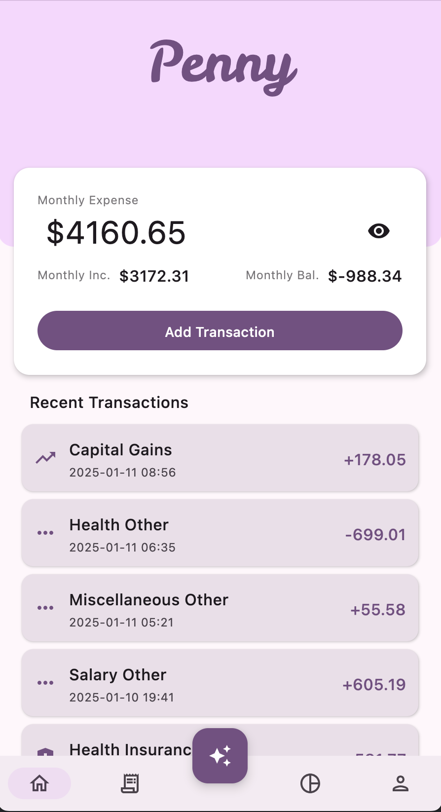
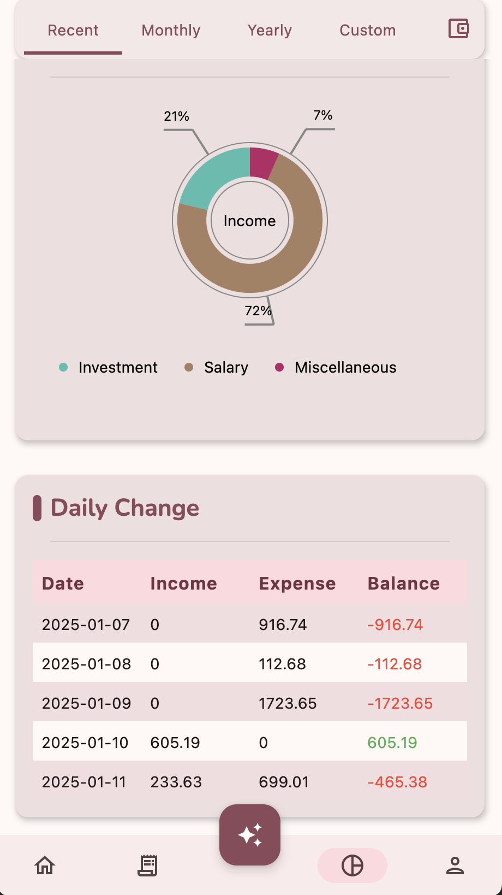
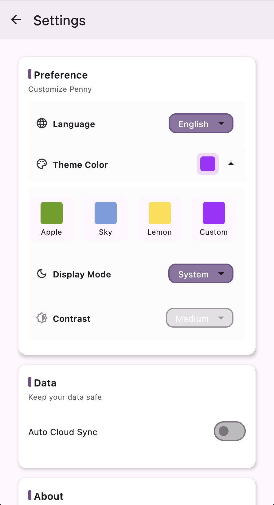

<div align="center">
    
    <h2>Penny</h2>
</div>

---

<div align="center">


</div>
A modern, AI-powered financial management application built for the next generation of users. Penny
helps you track expenses, analyze spending patterns, and make smarter financial decisions with ease.

## Features

### 🌩️ Cloud Sync & Storage

- Seamlessly synchronize your financial data across all your devices
- Secure cloud storage ensures your data is always backed up and accessible
- Real-time synchronization keeps your records up-to-date everywhere

### ✨ AI-Powered Automation

- Automatic transaction categorization using advanced AI technology
- Smart chatbot assistant for financial advice and queries
- Automated monthly report generation with insights and recommendations
- Natural language processing for quick and easy expense entry
- Voice input for hands-free transaction recording

### 📊 Data Visualization

- Interactive spending trend analysis
- Category-wise expense distribution through intuitive pie charts
- Daily asset change tracking for better financial planning

### 🎨 Customizable Themes

- Fully i18n support with English and Chinese
- Modern and youth-oriented design philosophy
- Extensive theme customization options to match your style
- Dark/Light mode support with custom color schemes

## Gallery

---

### Dashboard

<table>
  <tr>
    <td></td>
    <td></td>
    <td></td>
  </tr>
</table>

### Analytics

<table>
  <tr>
    <td></td>
    <td></td>
  </tr>
</table>

### Profile

<table>
<tr>
<td></td>
<td></td>
</tr>
</table>

### Multiplatform

[](screenshot/multiplatform.png)

## Getting Started

---

### Prerequisites

- **Operating Systems**:
    - Windows 11
    - macOS Sonoma (Sequoia)
- **IDE**:
    - Android Studio 2024.2.1 (Ladybug)
    - Xcode 16.1
        - Package Manager: CocoaPods 1.16.2

> Note: The application should work in similar development environments. This information is
> provided as a reference to ensure optimal compatibility.

## Installation

Penny is a full-stack project. For a complete experience, you'll need to set up both the server and
client applications.

The instructions below are for setting up a test environment at your **local network**.

### Cloning the Repository first

```shell
git clone https://www.github.com/TinkerAC/penny.git
```

### Server Setup

#### Building from Source \[Recommended\]

1. Navigate to `server/src/main/resources` directory
2. Modify the configuration blocks for:
    - port
    - database
    - openai
      (At minimum, you need to configure the database settings for your MySQL environment)
3. Create a database named `penny_server` in your specified database. The Exposed ORM will
   automatically create tables on startup.
4. Run the following command in the project root directory:
   ```shell
    ./gradlew :server:shadowJar
   ```
   After completion, find `server-all.jar` in the `server/build/libs/` directory
   5.Run the server:
   ```shell
   java -jar server-all.jar
   ```

#### Using Pre-built Application\[May not be the latest version\]

1. Download the latest server program `penny_server.jar` from the release page.

2. You may need to extract `penny_server.jar` and modify the configuration file (`application.conf`)
   located in the same directory.

3. Follow the same configuration steps as building from source, then repackage the server program
   using:
   ```shell
   jar cvfm penny_server.jar META-INF/MANIFEST.MF -C penny_server/ .
   ```

4. Run the server using:
   ```shell
   java -jar penny_server.jar
   ```
   The server should start and listen for requests on your local network.

Note: While you can deploy the server to a cloud provider, please be aware that the default
configuration is not secure. Modify the configuration file appropriately for production
environments.

### Client Application Setup

#### Building the Application from Source\[Recommended\]

1. getting your running server IP address and port(such as "http://192.168.1.2:8080")
2. Navigate to the `shared/src/commonMain/kotlin/app/penny/config/Config.kt` file
3. Modify the `DEFAULT_URL` constant to your server address

<details>
<summary> 🖥️ Desktop Application</summary>

```bash
# Using Gradle
./gradlew :ComposeApp:run
# Or using Android Studio
Run the `Penny Desktop` configuration at "Run Configurations"
```

</details>

<details>
<summary>📱 Android Application</summary>

1. Select the `Penny Android` configuration
2. Choose your target device/emulator
3. Click the "Run" button or press `Shift + F10`

</details>


<details>
<summary>🍎iOS Application </summary>

### Xcode

1. open `iosApp/iosApp.xcworkspace` in Xcode
2. set your team in the `Signing & Capabilities` tab
3. Select your target device/simulator
4. Click the "Run" button or press `⌘ + R`

> Note: To run the iOS app on a physical device, you need to have a valid Apple Developer account
> and a provisioning profile set up in Xcode,
> and you need to trust the developer certificate on the device.
 
</details>

#### Using Pre-built Application\[May not be the latest version\]

Go to the release page and download the latest version of the application for your platform.

## To Try Key Features

---

See [Here](docs/Guide_en.md) for a detailed guide on how to use the key features of the application.

## Tech Stack

---

### Core

- **[Kotlin Multiplatform](https://kotlinlang.org/docs/multiplatform.html)**: Cross-platform
  development
- **[Kotlin Coroutines & Flow](https://kotlinlang.org/docs/coroutines-overview.html)**: Asynchronous
  programming

### Data Management

- **[SQLDelight](https://sqldelight.github.io/sqldelight)**: SQL database for storing financial data
    - Local persistence
    - Offline-first capability
- **[Ktor](https://ktor.io/)**: HTTP client for network requests
- **[Kotlinx Serialization](https://github.com/Kotlin/kotlinx.serialization)**: JSON serialization

### Dependency Injection

- **[Koin](https://insert-koin.io/)**: Lightweight DI framework

### Resources Management

- **[Moko Resources](https://github.com/icerockdev/moko-resources)**: Shared resources across
  platforms

### Presentation & UI

- **[Compose Multiplatform](https://www.jetbrains.com/compose-multiplatform/)**: UI framework for
  all platforms
- **[Voyager](https://voyager.adriel.cafe/)**: Navigation library

## Modules & Directory Structure

---

### :shared

Contains the shared codebase for the application, including the data model, business logic, and UI
build with Compose Multiplatform.

### :composeApp

depended on :shared module,

Contains the entry point for supported platform ,include Desktop and Android.

### :server

depended on :shared module,

Contains the server-side codebase for the application, including the API routes ,database setup and
AI feature implementation.

### Dir `iosApp`

Contains the Xcode project for the iOS application.

### Dir `shared/server_shared`

Contains the shared codebase for the server-side application, including the data model and
request/response encapsulation.

## License

---

This project is licensed under the Apache License 2.0 - see the [LICENSE](LICENSE) file for details.

## Acknowledgments

- [AAY-chart](https://github.com/TheChance101/AAY-chart)  
  A library contains several chart composables for usage in Kotlin Multiplatform projects and
  Android Native, developed by [TheChance101](https://github.com/TheChance101).  
  Copyright (c) 2023 The Chance  
  The code under `/shared/src/commonMain/kotlin/app/penny/presentation/ui/components/aayChart`
  contains modified versions of AAY-chart code, used under the MIT License.

  


